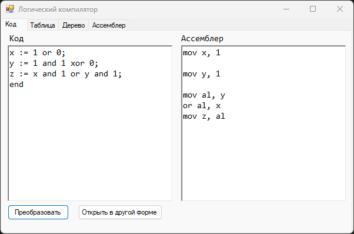
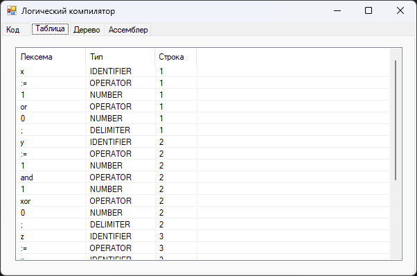
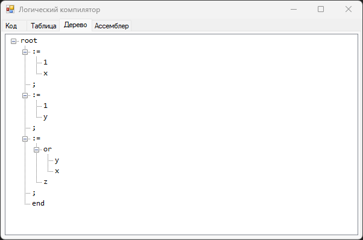
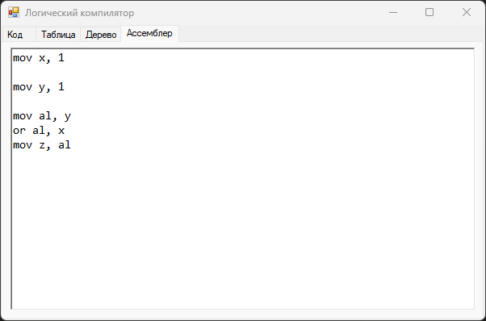

# Boolean Expression Compiler

Учебный проект — транслятор логических выражений в ассемблерный код (x86).  
Реализован в рамках курса «Теория автоматов и формальных языков».

## Что делает

Принимает программу на простом языке логических выражений и транслирует её в ассемблерный код x86.

**Входной язык:**
- Идентификаторы, константы `0` и `1`
- Операции: `or`, `xor`, `and`, `not`, `:=`
- Разделитель выражений: `;`, завершение: `end`

**Пример входных данных:**
```pascal
x := 1;
y := x and 1;
z := x or not y;
end
```

**Сгенерированный ассемблер:**
```asm
mov x, 1

mov y, x

mov al, y
not al
or al, x
mov z, al
```

## Этапы трансляции

1. **Лексический анализ** — токенизация входного текста, построение таблицы лексем (лексема, тип, строка)
2. **Синтаксический анализ** — построение AST с учётом приоритетов: `not` → `and` → `or / xor`
3. **Оптимизация AST** — свёртка константных выражений (`A and 1` → `A`, `A or 0` → `A` и др.)
4. **Генерация кода** — обход дерева снизу вверх, генерация инструкций `mov / and / or / xor / not`

## Интерфейс

Четыре вкладки:

### Код
Ввод программы слева, ассемблерный вывод справа. Кнопка «Преобразовать» запускает все этапы трансляции. При наличии ошибок выводится сообщение с указанием строки.



### Таблица лексем
Результат лексического анализа: каждый токен с типом (`IDENTIFIER`, `OPERATOR`, `NUMBER`, `KEYWORD`, `DELIMITER`) и номером строки.



### Синтаксическое дерево
Визуализация AST после парсинга и оптимизации.



### Ассемблер
Итоговый ассемблерный код отдельной вкладкой.



## Стек

- **C#**, .NET Framework
- WinForms

## Запуск

1. Открыть `auto.sln` в Visual Studio
2. Build → Run (F5)

## Лицензия

Распространяется под лицензией MIT. Подробнее: файл [LICENSE](LICENSE).